# ESO Roadmap (Rough Book)
**Status**: Dynamic / Ever-changing
**Purpose**: A scratchpad for daily ideas and a live roadmap of the system's growth.

## 🗺️ Current Roadmap

```mermaid
flowchart TD
    Phase1[Phase 1: Foundation] --> Phase2[Phase 2: Context Bridge]
    Phase2 --> Phase3[Phase 3: Data Synergy]
    Phase4[Phase 4: Agent Colony]
    
    subgraph Phase1
        A1[Create /eso structure] --- A2[Write architecture.md]
        A2 --- A3[Data Inventory]
    end

    subgraph Phase2
        B1[AI Orchestration Guide] --- B2[Recovery Protocol]
        B2 --- B3[First 'Bridge' Script]
    end

    subgraph Phase3
        C1[Read Obsidian Tasks] --- C2[Update Dashboard automatically]
        C2 --- C3[Universal Context Generator]
    end

    subgraph Phase4
        D1[Build Background Research Agent] --- D2[Personalized Learning Quizzer]
        D2 --- D3[Automated Backup & Cleanup]
    end

    style Phase1 fill:#07241A,stroke:#4ECDA4
    style Phase2 fill:#0A1628,stroke:#4A9EF5
    style Phase3 fill:#241607,stroke:#D4A843
    style Phase4 fill:#1A0A28,stroke:#9B7FE8
```

---

## 🗒️ Rough Thinking (Current Session)
*(Dump your immediate ideas, breakthroughs, or worries here before they fade)*

- 
